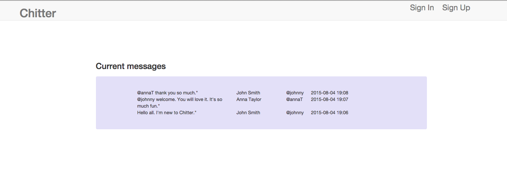
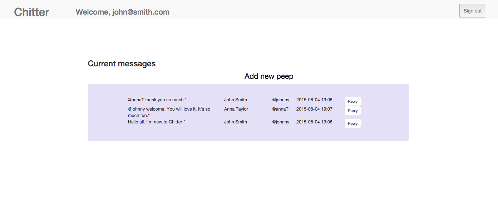

[](https://codeclimate.com/repos/55b38c3ae30ba01522002833/feed)  [](https://travis-ci.org/AnnaKL/chitter-challenge)  [](https://coveralls.io/github/AnnaKL/chitter-challenge?branch=master)

Chitter Challenge
=================

  

Challenge:
-------

A chitter (inspired by Twitter) that allows user to post messages(peeps).

Features:
-------

```sh
As a Maker
So that I can post messages on Chitter as me
I want to sign up for Chitter

As a Maker
So that I can post messages on Chitter as me
I want to log in to Chitter

As a Maker
So that I can avoid others posting messages on Chitter as me
I want to log out of Chitter

As a maker
So that I can let people know what I am doing
I want to post a message (peep) to chitter

As a maker
So that I can see what others are saying
I want to see all peeps in reverse chronological order
```

Implemented functionalities:
------------------------------

* Sign up
* Sign in
* Logout
* Error messages displayed when email or username are not unique
* Error message displayed when password do not match password confirmation
* Post messages only when user is logged
* See messages on the homepage when user is not logged
* Messages have name, username and current time attached
* Messages are displayed in reverse chronological order.


Technologies:
----------
* Ruby
* Sinatra (web application library and domain-specific language written in Ruby)
* PostgreSQL (open source object-relational database system)
* DataMapper (Object Relational Mapper written in Ruby)
* RSpec and Capybara (used for testing)
* HTML
* CSS


How to run:
----------
* To install run bundle install in the application directory
* To run the test type 'rspec'in the application directory
* To launch the local version type 'rackup' in the application directory and type 'http://localhost:9292/' in the browser.


